<div align="center">

# 🏥 MediTrack

### AI-Powered Personal Healthcare Companion for Every Indian Family

<table>
<tr>
<td align="center">🎙️<br><b>Voice AI</b></td>
<td align="center">💊<br><b>Medicines</b></td>
<td align="center">📊<br><b>Vitals</b></td>
<td align="center">📄<br><b>Reports</b></td>
<td align="center">👨‍👩‍👧<br><b>Family</b></td>
<td align="center">🚨<br><b>SOS</b></td>
</tr>
</table>

<br>

🏆 **DevFusion 3.0 Finalist • IIT Bombay**

<br>


</div>

---------------------------------------------------------------------

# 🎯 Problem Statement

Healthcare management becomes increasingly difficult as people age. Millions of elderly individuals and patients with chronic conditions struggle to manage medicines, monitor vital signs, organize medical records, and communicate important health information during emergencies.

Existing healthcare applications are often fragmented, English-centric, and designed for tech-savvy users, making them difficult for elderly people and their families to use effectively. Important features like medication reminders, AI assistance, multilingual communication, emergency response, health report generation, and family monitoring are usually spread across multiple applications.

MediTrack aims to solve this by providing a single AI-powered healthcare companion that combines medicine management, vital tracking, voice-assisted interaction, medical records, doctor appointments, health reports, emergency QR cards, and family connectivity into one simple, accessible, and elderly-friendly mobile application.

------------------------------------------------------------------------

## 📸 App Screenshots

<div align="center">

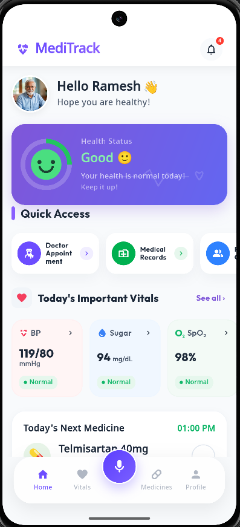
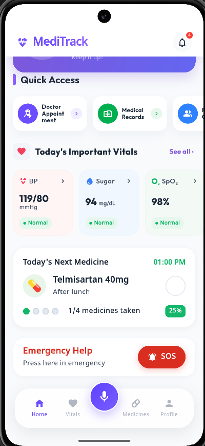
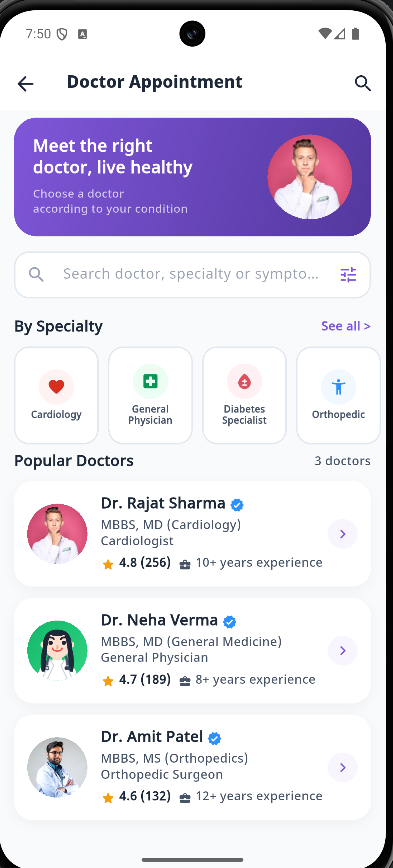

<br><br>

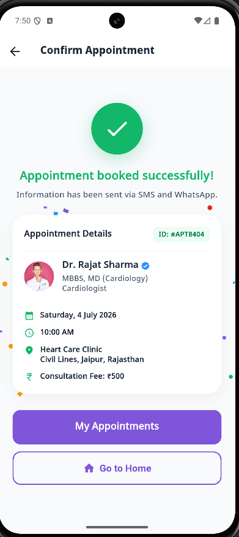
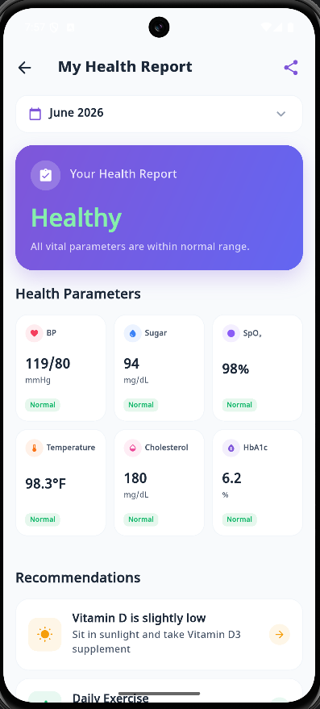
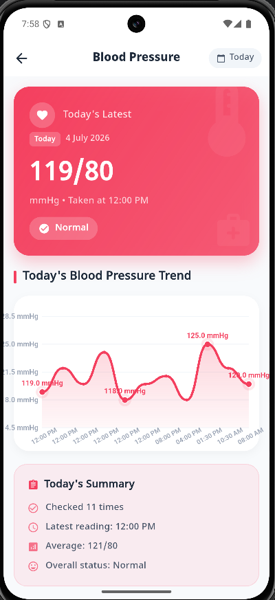

<br><br>

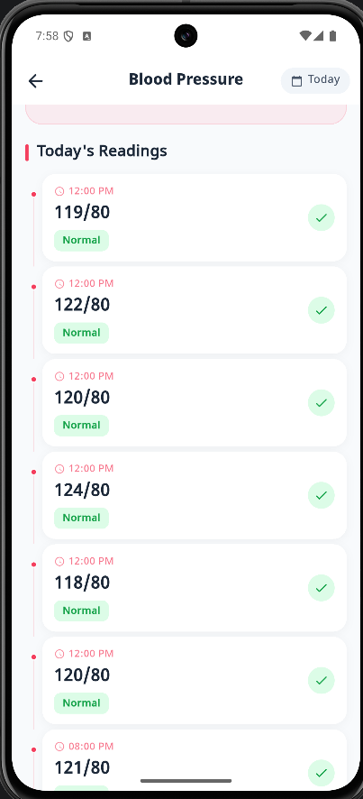
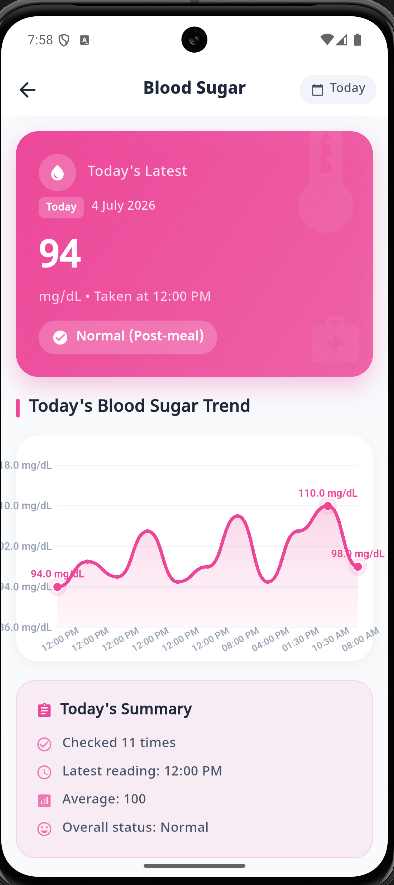
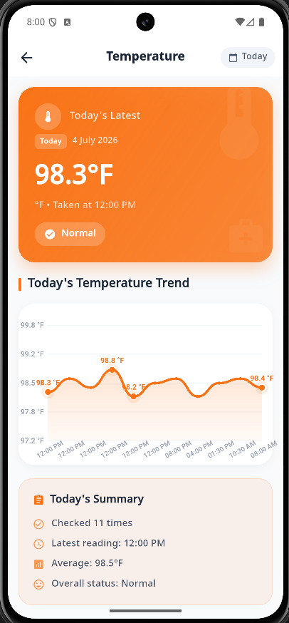

<br><br>

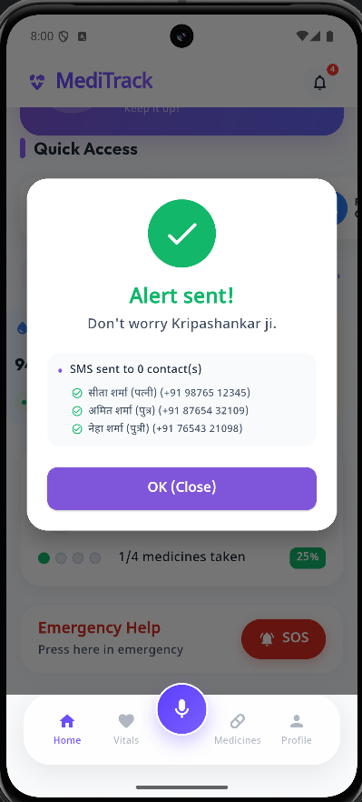
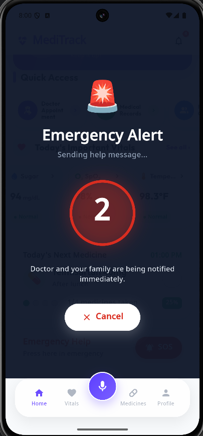
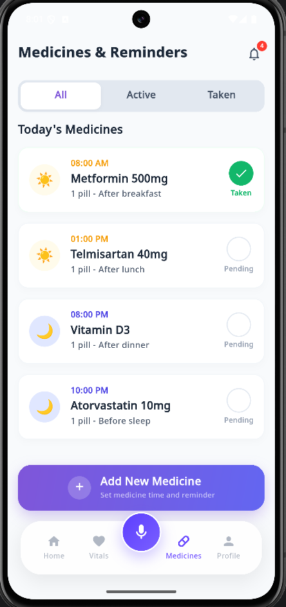

<br><br>

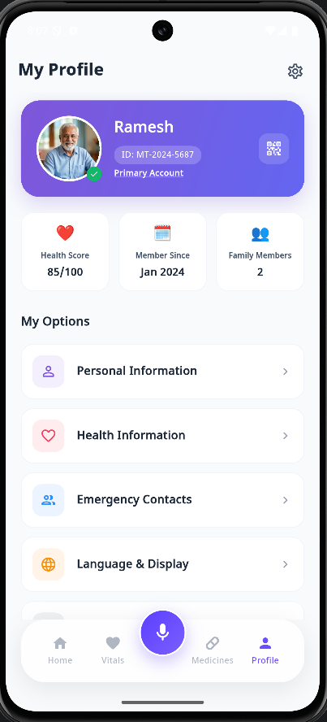
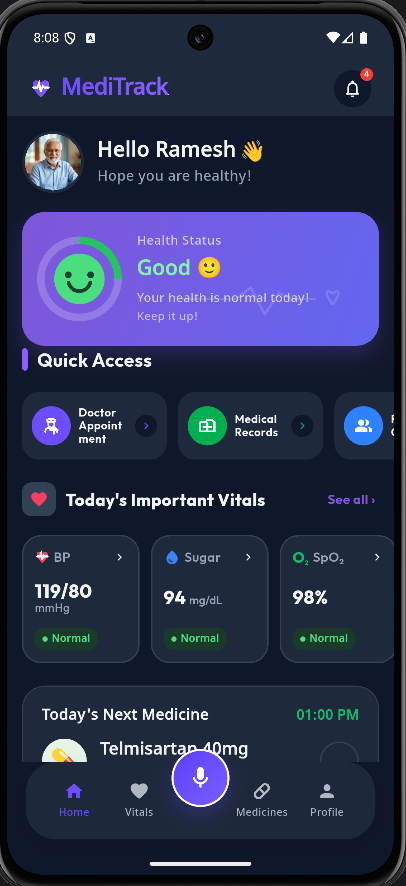
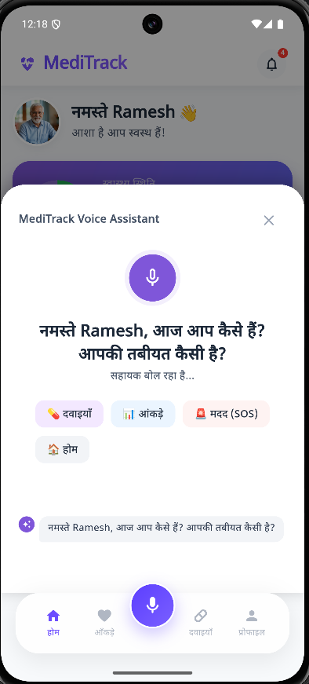

</div>

------------------------------------------------------------------------

# ✨ Features

-   🎙️ AI Voice Assistant (Hindi, English & Hinglish)
-   💊 Smart Medicine Reminder
-   📊 Vitals Monitoring
-   🏥 Doctor Appointment Booking
-   📄 Medical Records
-   📱 Health Report PDF
-   👨‍👩‍👧‍👦 Family Connect
-   🩺 Personalized Health Tips
-   🚨 One-Tap SOS
-   🌙 Dark Mode & Accessibility
-   📱 QR Patient Card

------------------------------------------------------------------------

# 🛠 Tech Stack

| Layer | Technology |
|--------|------------|
| **Mobile Framework** | Flutter 3.x |
| **Programming Language** | Dart 3.8 |
| **AI Model** | Meta Llama 3.3 |
| **AI Gateway** | OpenRouter API |
| **State Management** | Provider (ChangeNotifier) |
| **Voice Recognition** | speech_to_text |
| **Text-to-Speech** | flutter_tts |
| **Local Storage** | SharedPreferences |
| **HTTP Client** | http |
| **PDF Generation** | pdf |
| **QR Code Generation** | qr_flutter |
| **QR Code Scanner** | mobile_scanner |
| **Charts & Visualization** | Custom Canvas Painter |
| **File Sharing** | share_plus |
| **Image Picker** | image_picker |
| **Fonts** | Google Fonts (Outfit & Noto Sans Devanagari) |
| **Localization** | Flutter l10n (English + Hindi) |
| **Environment Variables** | flutter_dotenv |
| **IDE** | Android Studio / VS Code |
| **Version Control** | Git & GitHub |

------------------------------------------------------------------------

# 🏗 Architecture

``` text
                     User
                      │
              Flutter Application
                      │
     ┌────────────────┼────────────────┐
     │                │                │
 Voice Assistant   Medicine       Vitals
     │                │                │
     └──────── Provider State ─────────┘
                      │
          Business Logic & Services
                      │
      OpenRouter • SharedPreferences
```

------------------------------------------------------------------------

# 📂 Project Structure

``` text
lib/
├── config/
├── models/
├── providers/
├── screens/
├── services/
├── theme/
├── utils/
└── main.dart
```

------------------------------------------------------------------------

# ⚙ Setup

``` bash
git clone https://github.com/kripashankarcs3/MediTrack.git

cd MediTrack

flutter pub get

flutter run
```

Create a `.env` file:

``` env
OPENROUTER_API_KEY=your_key_here
```

------------------------------------------------------------------------

# 💡 Key Innovations

-   Voice-controlled health logging
-   AI-powered health companion
-   Elderly-first UI
-   Bilingual support
-   QR emergency profile
-   Health report generation
-   Family health management

------------------------------------------------------------------------
# 👥 Team

| Member | Responsibilities |
|--------|------------------|
| **Deep Raj** | Team Lead • UI/UX Design • Documentation |
| **Kripashankar Yadav** | Flutter Developer • App Development |

 -----------------------------------------------------------------------

# 🚀 Hackathon Journey [150+ Teams]

🥇 Round 1 — Aptitude Assessment *(Top 3)*

💡 Round 2 — Idea & Prototype Submission

💻 Round 3 — 24-Hour Hackathon *(Top 30 Teams)*

🎤 Round 4 — Jury Interview (Top 10 Teams)

🏆 Finalist *(Top 10 Teams)* — DevFusion 3.0, IIT Bombay

------------------------------------------------------------------------

# 🛣 Future Roadmap

-   WearOS Support
-   Smartwatch Integration
-   Cloud Backup
-   OCR Medicine Scanner
-   AI Diet Planner
-   Doctor Dashboard
-   Caregiver Portal
-   Offline Support

------------------------------------------------------------------------

<div align="center">

### ⭐ If you found this project interesting, consider giving it a star!

Built with ❤️ by **Team MediTrack**

🏆 DevFusion 3.0 Finalist • IIT Bombay

*"Making healthcare smarter, simpler, and accessible for everyone."*

</div>
